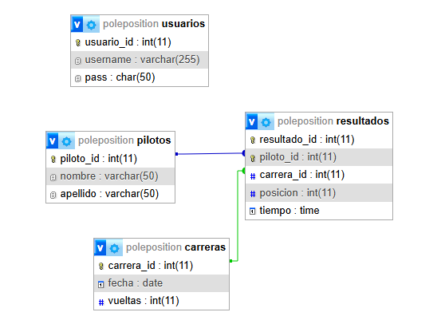

# pole-position-web2-tudai

## Integrantes:

* Martin Nicolas Larrosa | (martinnicolas.larrosa@gmail.com)

* Agustin Ciantini | (agustinciantini10@gmail.com)

## Tematica:

El sistema está diseñado para llevar un control integral de los clientes, las carreras y la gestión interna del kartódromo. Permite registrar a cada piloto con sus datos personales, organizar y programar las carreras realizadas en el circuito, así como administrar los resultados obtenidos en cada competencia. Además, ofrece herramientas de gestión interna para el kartódromo.

## Guía para cargar database:

Para cargar nuestro sitio en un servidor Apache o MySQL, primero, deberas tener instalado XAMPP. Una vez descargado, tendrás que crear nuestra base de datos "poleposition" en phpMyAdmin entrando a la url "http://localhost/phpmyadmin", de ahi se clickea "New" , y se pone el nombre de nuestra base de datos que sera "poleposition" (las tablas se crean automáticamente por la implementación del auto-deploy)

Una vez que la base de datos esté creada en phpMyAdmin, coloca los archivos en la carpeta "htdocs" de tú XAMPP y ingresa en la url "http://localhost/polePosition".

## ¿Cómo inicio sesión?
Para iniciar sesión y poder realizar acciones dentro de nuestra página web, es necesario loguearse con las credenciales adecuadas. Los datos son:

Usuario: webadmin
Contraseña: admin

## DER:

